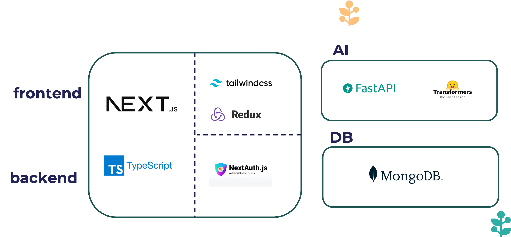

# Nae Essay

에세이를 작성하고 공유하며 자동 채점을 받을 수 있는 웹사이트 입니다.

## 개요

> 학생들이 자신의 생각을 글로 표현하고 다양한 의견을 존중하며 토론할 수 있는 공간을 제공

사람들은 자기 생각이나 일상을 공유하는 것을 즐거워합니다. 
따라서 흥미로운 주제를 중심으로 자신의 에세이를 공유하는 플랫폼이 있다면 학생들이 더 즐겁게 에세이를 쓸 수 있을 것입니다.

-   학원
-   학교
-   건전한 온라인 커뮤니티

학생들 뿐만 아니라 성인들도 자신의 에세이를 공유 하기위한 건전한 온라인 커뮤니티로 사용할 수 있습니다.

## 주요기능

### 1.주제 혹은 에세이를 북마크 하거나 좋아요 기능으로 재 탐색

> 북마크 기능: 주제를 북마크하고 마이페이지에서 탐색 할수 있습니다.


> 좋아요 기능: 에세이에 좋아요를 누르고 마이페이지에서 확인 할수 있습니다.


### 2. 에세이 작성 온라인 에디터 및 수정 삭제 기능

> 주제 페이지에서 글쓰기 버튼을 눌러서 에세이를 작성할 수 있고 수정 혹은 삭제가 가능합니다.


### 3. 자신이 쓴 에세이들을 자동으로 채점하는 Automated Essay Scoring 기능 제공

> 마이페이지의 에세이 탭에서 에세이를 자동으로 채점할 수 있습니다.


### 4. 에세이 댓글 및 수정 삭제 기능


## 시스템 구성도



**Frontend**

```
-   Tailwind CSS
-   NextAuth
-   ReactQuery
-   Typescript
-   Lexical editor
```

**Backend**

```
-   Nextjs pages api
-   MongoDB adapter
-   NextAuth
```

**AI**

```
-   FastAPI
-   huggingface Transformer
```

**DB**

```
-   MongoDB
```

**Version Control**

```
-   git, github
```

## 재작 기간


2024.09.02. - 2024.11.20
